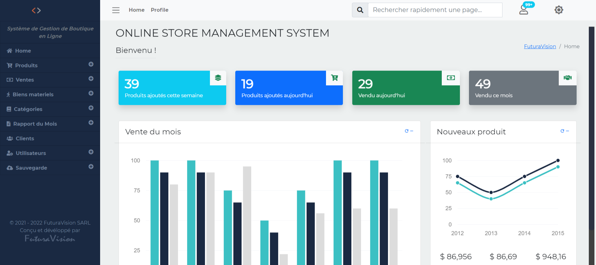

# Neptune

Neptune is a web application for stock management with an automatic billing system and inventory management for various shops.

## Installation

To install Neptune, follow these steps:

- Make sure you have `PHP>=7.4` installed on your machine.

- Clone the Neptune repository from GitHub:

```bash
git clone https://github.com/BlakvGhost/Neptune.git
```

Host the project on a local server for testing, or host it on a shared hosting service or a VPS.

### Option 1: Creating a Virtual Host

- Open the Apache configuration file (httpd.conf or httpd-vhosts.conf).

- Add the following virtual host configuration:

```apache
<VirtualHost *:80>
    DocumentRoot "/path/to/Neptune/public"
    ServerName neptune.local
</VirtualHost>
```

- Save the changes and restart Apache.

### Option 2: Using the Built-in PHP Development Server

- Open a terminal and navigate to the project's root directory.

- Run the following command:

```bash
php spark serve
```

- The project will be served on <http://localhost:8080>.

## Database

Follow these steps to set up the database:

- Create a new database with the following details:
  - Name: `neptune_app`
  - Host: `localhost`
  - Password: `(leave it empty)`
  - User: `root`

- Import the `db.sql` file into your new database.

- If needed, you can edit the `.env` file to configure your database settings.

## Test My Online Hosted App

You can try out the hosted version of the app at <http://neptune.kabirou-alassane.com>

To log in, use the following credentials:

`Number`: 90010203

`Password`: 90010203

## Screenshots



## Tech Stack

**Client:** HTML5, CSS3, ES6, JQuery, Ajax

**Server:** PHP, CodeIgniter4

## Authors

- [@BlakvGhost](https://github.com/BlakvGhost)

- [@v1p3r75](https://github.com/v1p3r75)

## License

[](https://choosealicense.com/licenses/mit/)
[](https://opensource.org/licenses/)
[](http://www.gnu.org/licenses/agpl-3.0)

## Support

For support, email me on <dev@kabirou-alassane.com>.
